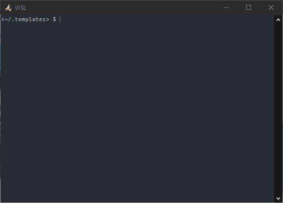

# project-templates.nvim

I made this plugin mainly out of pure frustration. I had been using the extension [Project Templates](https://marketplace.visualstudio.com/items?itemName=cantonios.project-templates) back when I used VSCode as my IDE, and I had come to rely on it. When I migrated to Neovim, I thought "this extension was sooo helpfull! Clearly there _must_ be an equivialent for vim, right?" I went searching and searching, but I couldn't find _anything_. There were plugins that created templates for individual files, and even multiple related files, like [templator_vim](https://github.com/tomtom/templator_vim), but nothing that creates templates for an entire project, that defines the project structure and boilerplate code for each necessary file. In most IDEs, the IDE will take care of these things for you automatically when you start a new project. But with vim, you have to create each individual file and folder yourself. This plugin aims to fix that.

## Demo:

# Quick Start

## Requirements

You will need neovim compiled with python3 support. To determine whether or not your neovim has python support, type `:echo has('python3')` and press enter. If it outputs `1`, you have python3 support, otherwise you will need to run the command `pip install pynvim`.

You will also need to run the command `pip install binaryornot`.

## Installation

Add this to your init.vim:

- vim-plug:
  - `Plug 'pianocomposer321/project-templates.nvim', { 'do': ':UpdateRemotePlugins' }`
 
- Vundle:
  - `Plugin 'pianocomposer321/project-templates.nvim', { 'do':  ':UpdateRemotePlugins'}`

etc, etc.

Then run `:PlugInstall` (vim-plug) or `:PluginInstall` (Vundle).

Finally, restart Neovim.

# Usage

- `:LoadTemplate` - Load a template into a new project. The plugin will look for placeholders (e.g. `#{PLACEHOLDER}`), and ask for values to replace them in each non-binary file
- `:DeleteTemplate` - Delete a template
- `:SaveAsTemplate` - Save the current folder and all files and subfolders as a new template

The plugin will look for templates in ~/.templates. Sample templates can be found at https://github.com/pianocomposer321/project-template-samples. If you want to create your own templates, simply create a new project, add the placeholders you want, and save it in ~/.templates, or use the `:SaveAsTemplate` command.

# Credits

Finder.vim - https://vim.fandom.com/wiki/Implement_your_own_interactive_finder_without_plugins

Inspired by [This](https://github.com/bit101/ProjectMaker) Sublime text plugin and [this](https://github.com/cantonios/vscode-project-templates) VS Code Extension.
